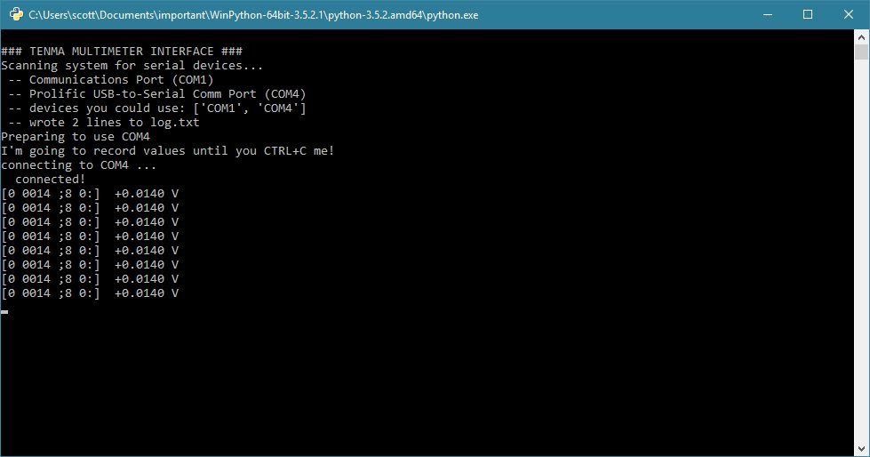

# pyTENMA
**pyTENMA provides a simple Python interface to access data from TENMA multimeters via their serial connection.** Many TENMA multimeters have an IR transmitter on the back which allows an optically-isolated means to transmit data from the meter to the computer. However, the software that comes with the multimeter is extremely limited -- it's Windows only, closed-source, can't save log data automatically, the graph is not interactive and it's broken more often than not, and the output format is an excel spreadsheet and not a flat text file. Therefore, I wrote a python solution which listens to data arriving from the multimeter on the serial port, analyzes it, and saves it. I also included a demo spython script showing how to graph the data and either interact with the graph or save it as an image. TENMA multimeters are nice and I love their PC connection. I'm happy I can now interact with it on systems like my Raspberry Pi. 

**SEE PROJECT PAGE FOR DETAILS:**
* http://www.swharden.com/wp/2016-08-24-tenma-multimeter-serial-hack/

## Features
* Single file `pyTENMA.py` program which does not need to be installed
* Work on Windows, Linux, and MacOS
* can be run from the console (perfect for long term data loggers or headless machines or raspberry pis)
* automatic serial port detection (if you dont know what com port to use)
* uses standard libraries! If you have Python on your system, you shouldn't have to install anything.
 * to make graphs though, you'll need numpy and matplotlib
 * If you're on Windows and don't have Python, install [WinPython](https://sourceforge.net/projects/winpython/)
* allows saving data to disk as a log file
 * data is saved automatically every 20 seconds
 * data is in text file format and does not require commercial software to view

## Screenshots

The primary output is very simple. Inside [brackets] is the data the multimeter sends (with added spaces to improve readability). To the right are the correct values/measurements and units determined by parsing the string. Glance at the top of the code for a full description of what this string means (and what I still haven't figured out).

The included `logPlot.py` script demonstrates how to generate a graph from a recorded log file. The data shown here is recorded from the experiment pictured in the next image.

In this case I charged a 22uF capacitor in a breadboard with +5V and let it sit there for a long time. As the capacitor leaked its stored potential, the beautiful RC curve was captured by the TENMA multimeter.

## TENMA Multimeter Resources
* PyroElectro has [a video demonstration](http://www.pyroelectro.com/tutorials/tenma_digital_multimeter/software.html) of the TENMA multimeter / PC link using their commercial software.
* I developed this software for the TENMA 72-7750 but I assume most similar multimeters output the identical serial format, so I expect this software will work for multiple meters.
* The [TENMA 72-7750 manual](http://www.farnell.com/datasheets/70028.pdf) is available online.

## Serial Notes

I lost half a day because I couldn't figure out how to get Python to read these serial values. When the commercial program ran, data came out. When I used a serial sniffing program, I could see the packets. When I tried to interact with the serial port directly, I could never see any data. After a lot of probing (and wishing I had a logic analyzer on hand) I eventually figured out that you have to flip the RTS and DTR serial pins to either source of sink current properly. This is because the circuit in the IR receiver is passive (voltage wise) and "sucks" current from the serial port. Leaving them both high or both low won't allow the signal to come through. I figured out which pins needed to be in which states and hard-coded it into the python script. It seems obvious now, but it took me a while to realize.

